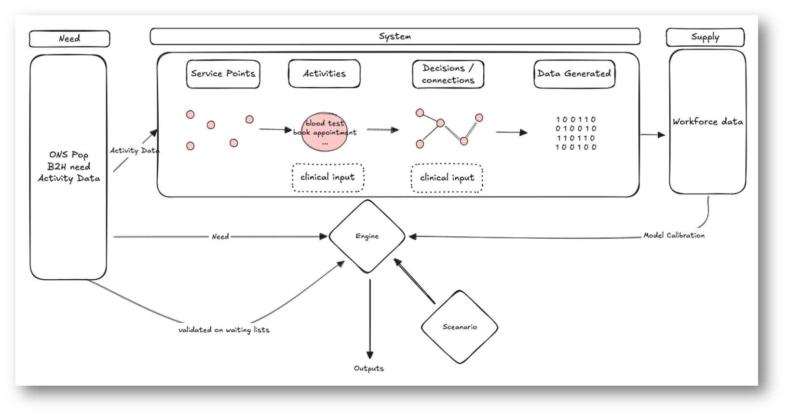
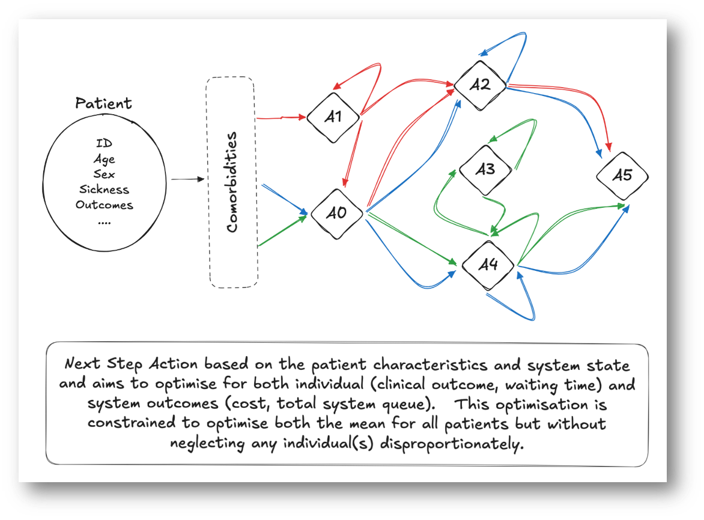

# Healthcare Simulation Automated Decision Exploration

**Goal:** Demonstrate considerations for the design of the decision-making mechanism that is configurable, explainable and can handle the variation and complexities of patient pathways.

## Healthcare System Digital Twin

A digital twin needs to have a layer of simulation more granular than the situation it’s trying to replicate to enable scenarios to be simulated at the intervention level (e.g. clinical decision) which then outputs data at the observable level (e.g. activity data).   Therefore, a model is needed which simulates the decisions made in a pathway rather than just the data produced. 

For example, a digital twin of a heart starts by building a structural mesh, builds muscles on this mesh, and then defines how the muscles interact with one another.   It then simulates an input (electrical signals) and finally observes the blood flow measuring the rates and pressures to validate if the heart is an accurate simulation.    The model in this situation is the muscles, the inputs are electrical signals, the supply is the constraint on the size and pressure the muscles can cope with, and the output is the blood flow.

For our interests we need to build a mesh of connected actions or pathways (akin to the muscles) as the model.  The input is then a patient need defined at the population level (ideally independent from the supply).   The constraint is the supply defined by the number of actions available per time-period.   The output is the activity and waiting times data (akin to pressure and flow in the heart). 

A scenario would take the form of changing either:

The input need (e.g. changes to public health, initiatives and moving from treatment to earlier prevention)
The model system (e.g. changes to clinical thresholds and priorities such as moving from secondary to community)
The supply (e.g. changes to funding or workforce retention/recruitment questions)
As none of these changes are conducted on the activity data the model is not being recursive (i.e. visualising its own assumptions) but is instead a valid simulation of the scenarios.

    

1. System Service Points & Activities Config
    - The system is composed of service points with activities (e.g., blood test, appointment booking) defined through clinical input.
    - Activities at each point are connected to represent clinical pathways, where decisions are made dynamically based on individual interactions with thresholds.
    - Each activity generates structured data (event-level) that can be aggregated to create activity tables and waiting lists.  
2. Need Input
    - Patient need is derived from sources like ONS population data and the Bridges to Health (B2H) segmentation model to turn the population into a healthcare need.  Disease prevalence models could also be incorporated. 
3. Supply Input
    - Supply constraints come from workforce data, which must be modelled to reflect availability, capacity, and roles.
4. Simulation Engine
    - The engine runs the population through the system under current and alternative scenarios, enabling forecasting and impact assessment.
5. Validation
    - The waiting list profile would be used to validate the simulation.  

## The Engine

The engine progresses each individual in the system (and system characteristics) based on multiple decision criteria. The next_action and system_update decisions are complex or even chaotic due to the level of variation and the human factor. In reality, the conflicting priorities are decided using a multi-disciplinary team approach -> can this be simulated cleanly in out digital twin. Decisions are made at many different levels simultaneously (patient, ward, hospital, trust, ….)

    

## Scenarios

St. Luke’s hospital is under immense strain with bed occupancy high and elective waiting lists long.   There is a push from senior leads to optimise current patient flows and to prioritise a small amount of investment to have the greatest impact.

The operations team within a trust meets each morning to review the patient case load for elective admissions across multiple departments within the hospital.  Decisions need to be made regarding prioritisation of patients and if early discharge reviews are appropriate for some.   

They also need to make a recommendation as to where investment should be placed:
short-term temp low-cost workforce supply
medium-term medium-cost bed occupancy increases, or
long-term high-cost investment in social care to support discharges.

**Alternative Scenarios:**

- Scenario B, C and D have differing system settings and patient blockers

## Ask

The teams will be provided with some simple fake patient data (see next slide). 

In the 4.5 hours available, the teams should develop a decision-making mechanism that can be applied for the scenario A to produce:

- Patient Prioritisation List — for current and incoming patients.
- Early Discharge Flags — which current patients might safely leave early.
- Investment Recommendation — short, medium, or long-term — with a rationale.

Note: we are not looking for the most correct solution but one that is clear and explainable.

Once complete the same mechanism should be applied to scenarios B and C demonstrating how the different settings change the decisions 

Outputs should be presented as a 2–3 slide summary or dashboard output by the end of the hack.

**What does good look like?**

| Criteria    | Weighting | Description |
| -------- | ------- | ------|
| Clarity & Explainability | 35% | Is the mechanism understandable and rational?  Does it clearly show how the range of considerations have been considered? |
| Configurable / Generalisable | 25% | Can it adapt to new data or policy priorities? When applied to scenario B and C were decision boundary changes clear? |
| Simple / Efficient / Scalable | 20% | Have considerations of efficiency and scale been included? |
| Presentation & Insight | 10% | Is the approach and results clearly presented? |
| Creativity | 10% | Innovative approaches? |

## Fake Data

    

## Possible Methods

    

## Timeline of the day

**1st Session: 10.00 - 12.00**

- Step 1 – Understand the data and problem (20 mins)
- Step 2 – Choose an approach (10 mins)
- Step 3 – Build your mechanism(s) (90 mins)

**Lunch**

**2nd session: 13.15 - 16.00**

- Step 3 continued - Build your mechanism (30 mins)
- Step 4 – Test and explain (90 mins)
- Step 5 – Summarise for presentation (30 mins)
